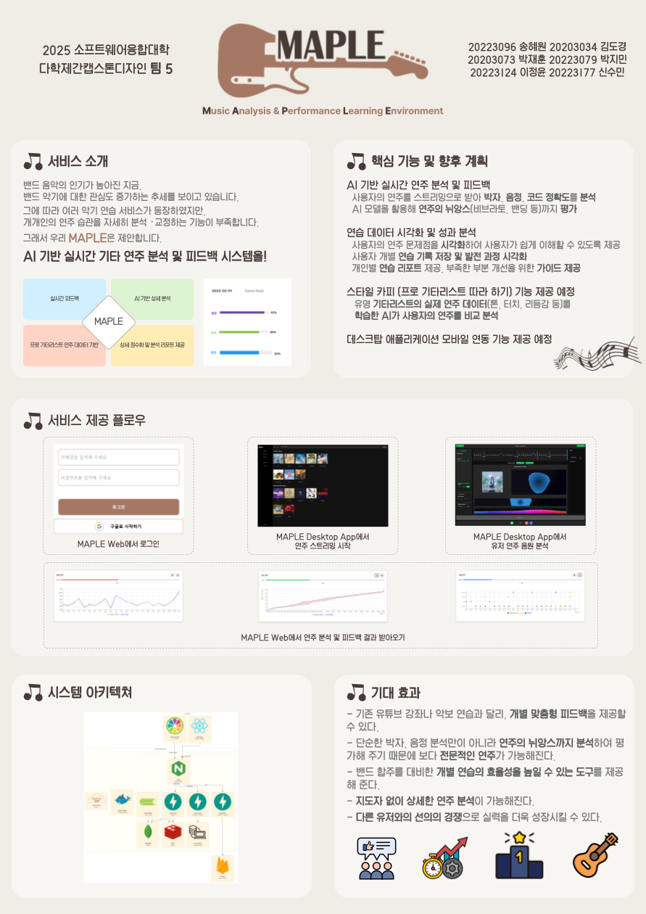

## 💡 프로젝트 소개

  

1. 프로젝트 개요

   MAPLE(Music Analysis & Performance Learning Environment)는 AI 기술을 활용해 기타 연주 실력을 정밀하게 분석하고, 사용자에게 실시간으로 맞춤형 피드백을 제공하는 시스템입니다. 사용자는 데스크탑 앱에서 자신의 연주 스트리밍을 시작하고, 웹에서 pitch, rhythm, technique 등의 측면에서 연주 정확도를 분석하고 시각화된 피드백을 제공합니다.

2. 배경 및 필요성

   최근 밴드 음악과 기타 연주의 인기가 급격히 증가하고 있으며, 많은 사람들이 유튜브나 SNS을 통해 연주 방법을 배우고 공유하고 있습니다. 그러나 대부분의 연습은 독학에 의존하고 있어 정확한 피드백을 받기 어렵고, 이는 곧 실력 향상에 한계가 됩니다. 이에 따라, **MAPLE**은 보다 상세하고 사용자가 수용하기 쉬운 피드백을 제공할 수 있는 AI 기반 연주 분석 시스템을 제공합니다.

---

## 🦾 주요 기능
### 🎵실시간 연주 분석 및 피드백
-사용자의 연주를 녹음하여 박자, 음정, 코드 정확도를 분석
-AI 모델을 활용해 연주의 뉘앙스(비브라토, 밴딩 등)까지 평가
-문제점을 자동으로 시각화하여 사용자가 쉽게 이해할 수 있도록 제공

### 🎸프로 기타리스트 따라하기
-유명 기타리스트의 실제 연주 데이터를 학습한 AI가 사용자의 연주를 비교 분석
-연주자의 톤, 터치, 리듬감 등을 반영한 피드백 제공
-사용자가 자신의 연주를 업로드하면, 원곡과 얼마나 비슷한지 점수화 및 분석 결과 제공

### 📊연습 데이터 시각화 및 성과 분석
-사용자별 연습 기록 저장 및 발전 과정 시각화
-개인별 연습 리포트 제공, 부족한 부분을 개선할 수 있도록 가이드
-게임화 요소(뱃지, 점수 시스템 등)를 추가하여 지속적인 연습 유도

### 🚀기존 시스템과의 차별점
-기존 유튜브 강좌나 악보 연습과 달리, 개별 맞춤형 피드백 제공
-단순한 박자/음정 분석이 아니라, 연주의 뉘앙스까지 평가 가능
-밴드 합주를 대비한 개별 연습의 효율성을 높일 수 있는 도구 제공

---

## 🛠 기술 스택
### Frontend

### Backend

### AI / Analysis
- 음정 인식 모델 (FFT 기반 + ML 보정)
- 리듬 분석 알고리즘 (Onset detection + Madmom)
- JSON 기반 시각화 데이터 반환

---

## 🌐 시스템 아키텍처

  
  

---

## 🎬 시연 영상

---

## 팀원 소개
<table>
  <tr align="center">
    <td style="min-width: 120px;">
      <a href="https://github.com/20223096">
         
        <b>송혜원</b>
      </a>
       
      20223096
    </td>
    <td style="min-width: 120px;">
      <a href="https://github.com/syngrxm">
         
        <b>신수민</b>
      </a>
       
      20223177
    </td>
    <td style="min-width: 120px;">
      <a href="https://github.com/lovelyoverflow">
         
        <b>박재훈</b>
      </a>
       
      20203075
    </td>
    <td style="min-width: 120px;">
      <a href="https://github.com/dgKim1">
         
        <b>김도경</b>
      </a>
       
      20203034
    </td>
    <td style="min-width: 120px;">
      <a href="https://github.com/qkrwlalss">
         
        <b>박지민</b>
      </a>
       
      20223079
    </td>
    <td style="min-width: 120px;">
      <a href="https://github.com/lyun1015">
         
        <b>이정윤</b>
      </a>
       
      20223124
    </td>
  </tr>
  <tr align="center">
    <td>Backend</td>
    <td>Backend</td>
    <td>AI</td>
    <td>Frontend, Design</td>
    <td>Frontend, Design</td>
    <td>Frontend, Design</td>
  </tr>
</table>
